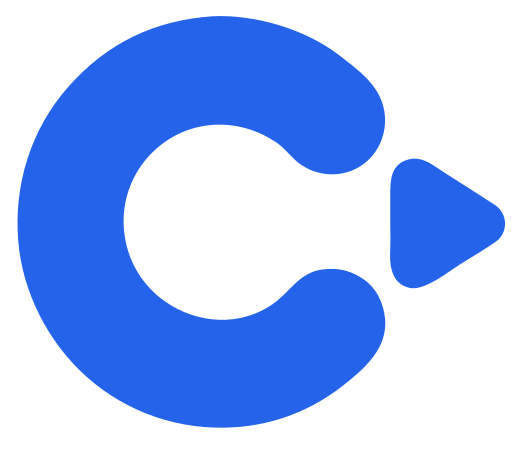

<div align="center">



# CPilot

### Competitive Programming Analytics Platform for Codeforces

Analyze your Codeforces profile with interactive visualizations, personalized recommendations, and performance insights.
**Live Demo:** https://cpilotapp.vercel.app

</div>

---

## Overview

CPilot is a full-stack analytics platform designed to help competitive programmers better understand their Codeforces performance.

It transforms raw contest and submission data into meaningful insights through interactive visualizations, detailed statistics, and an intelligent recommendation engine that helps users identify weaknesses and improve efficiently.

Whether you're a beginner or an experienced competitive programmer, CPilot provides a centralized dashboard to track progress and guide your learning.

---

## Features

### Analytics Dashboard

- Rating Journey visualization
- Contest statistics
- Problem solving distribution
- Language usage analysis
- Submission verdict analysis
- Topic-wise performance analysis
- Difficulty-wise solved problems

### Smart Recommendation Engine

- Personalized problem recommendations
- Rating-based difficulty selection
- Weak topic detection
- Balanced practice strategy
- Skill improvement suggestions

### Performance Insights

- Focus Areas
- Strongest Topics
- Weakest Topics
- Activity Statistics
- Rating Progress
- Submission Heatmap (planned)

### Platform

- Real-time Codeforces API integration
- Responsive UI
- Fast data fetching
- Modern interactive charts

---

# Screenshots

## Home Page


---

## Analytics Dashboard


---

## Rating Journey


---

## Problem Recommendations


---

## Tag Analysis


---

# Tech Stack

## Frontend

- React
- Vite
- Tailwind CSS
- Recharts
- D3.js

## Backend

- Node.js
- Express.js

## APIs

- Codeforces API

## Deployment

- Vercel
- Render

---

# Project Structure

```text
CPilot
│
├── frontend/
│   ├── public/
│   ├── src/
│   └── package.json
│
├── backend/
│   ├── controllers/
│   ├── routes/
│   ├── services/
│   └── package.json
│
└── README.md
```

---

# Getting Started

## Clone the Repository

```bash
git clone https://github.com/robinnits/CPilot.git

cd CPilot
```

---

## Backend Setup

```bash
cd backend

npm install

npm run dev
```

---

## Frontend Setup

```bash
cd frontend

npm install

npm run dev
```

The frontend will run on:

```
http://localhost:5173
```

The backend will run on:

```
http://localhost:5000
```

---

# Dashboard Modules

- Rating Journey
- Problems by Rating
- Tag Analysis
- Verdict Distribution
- Contest Statistics
- Tag Weakness
- Focus Areas
- Recommendation Engine

---

# Recommendation Engine

Unlike simple random recommendation systems, CPilot analyzes multiple aspects of a user's Codeforces profile before suggesting problems.

The recommendation engine considers:

- Current Codeforces rating
- Solved problem history
- Topic strengths
- Weak topics
- Difficulty progression
- Balanced rating distribution

This enables users to receive meaningful practice recommendations tailored to their current skill level.

---

# Future Improvements

- Compare multiple Codeforces users
- Contest performance prediction
- AI-generated performance review
- Weekly progress reports
- Submission heatmap
- LeetCode integration
- AtCoder integration
- CodeChef integration

---

# Live Demo

## Frontend

https://cpilotapp.vercel.app

## Backend API

https://cpilot-backend.onrender.com

---

# Contributing

Contributions are welcome!

If you have suggestions for improvements, feel free to:

- Fork the repository
- Create a feature branch
- Submit a Pull Request

---

# Contact

**Robin Poddar**

GitHub

https://github.com/robinnits

LinkedIn

https://www.linkedin.com/in/robinpoddar07/

---

# Support

If you found this project useful, please consider giving it a ⭐ on GitHub.

It helps others discover the project and motivates future development.

---

<div align="center">

Built with ❤️ using React, Node.js, Express, Tailwind CSS and the Codeforces API.

</div>